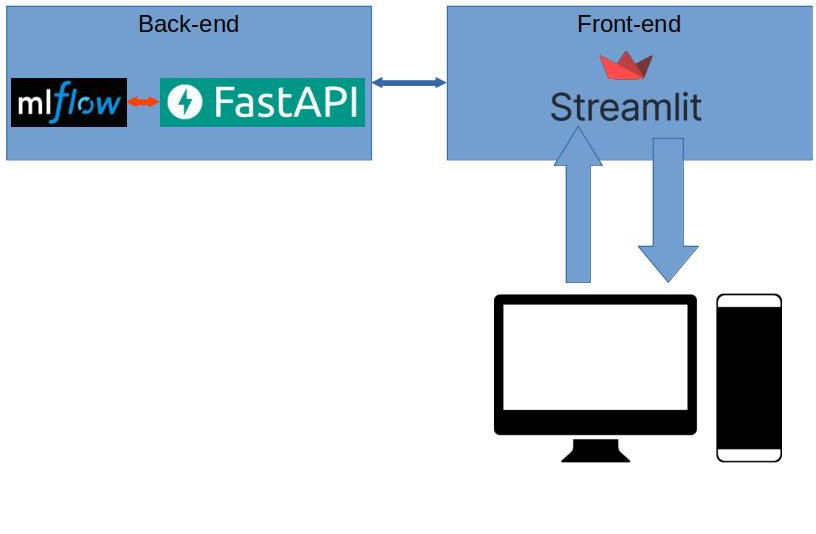

# Containerized MLflow Image Caption Model

## Overview

## Objective

___
## Pipeline Components
- MLflow tracking
- Deployment of best model via FastAPI
- Streamlit user interface to post data to FastAPI endpoint

## Get training data
- Run python sctipt to download training data: `python /data/getData.py`

## Train the model
- `MLflow` - start MLflow server by running: mlflow ui
- `Pytorch training` - run "training.py" to train the model

## Containerizarion
- User docker compose: docker-compose up -d --build

## webUI
- use "http://localhost:8501" to access the service front-end
- upload image and wait for the model to generate the image caption
___
## Project Files and Folders
- `/backend` - Contains files to setup backend service e.g. MLflow and FastAPI
    - `/data` - Data used for model training
    - `/mlruns` - ML runs from ML training experiments
    - `/mlartifacts` - ML artifacts from ML training experiments
    - `beheaded_inception3.py` - Beheaded Incpection3 model from torchvision
    - `Dockerfile` - Dockerfile to build backend service
    - `main.py` - Python script to serve ML artifacts via FastAPI
    - `MLproject`
    - `python_env.yaml`
    - `requirements-backend.txt` - python libraries to be installed during docker image build
    - `training.py` - Python script PyTorch training with MLflow tracking. Run with this command: `python training.py`
    - `utils.py`    - utility functions
- `/frontend` - Folder containining the frontend user interface (UI) aspect of project (i.e. Streamlit)
    - `app.py` - Python script for the Streamlit web app, connected with FastAPI endpoint for model inference
    - `Dockerfile` - Dockerfile to build frontend service
